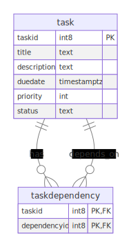

# To-do-list-Droppii

# Todo List Project

## 📌 Giới thiệu

Dự án **Todo List** là project ngắn hạn được thực hiện nhằm pass vòng 1 vị trí Intern Backend Developer tại Droppii.

## 🛠️ Công nghệ sử dụng:

- **Spring Boot**
- **PostgreSQL** (Partitioning, Indexing)
- **Hibernate & JPA**
- **Lombok**
- **Maven**
- **Redis**
- **Docker**

## 📂 Cấu trúc dự án

```
├── src
│   ├── main
│   │   ├── java/com/interviewproject/todolist
│   │   │   ├── config          # Cấu hình ứng dụng
│   │   │   ├── constants       # Định nghĩa các hằng số sử dụng trong ứng dụng
│   │   │   ├── controller
│   │   │   ├── exception       # Xử lý các ngoại lệ và lỗi trong ứng dụng
│   │   │   ├── handler
│   │   │   ├── model           # Định nghĩa các Entity
│   │   │   ├── repository
│   │   │   ├── service         # Xử lý logic nghiệp vụ chính
│   │   │   ├── specification   # Tạo truy vấn động với Spring JPA Specification
│   ├── resources
│   │   ├── application.properties  # Cấu hình Spring Boot
│   │   ├── task.sql                # File tạo bảng task và dữ liệu mẫu

```

## 🎯 Các tính năng chính

- [x] **Quản lý công việc (Task CRUD) và quản lý các phụ thuộc (Dependency CRUD)**
- [x] **Sử dụng Redis Cache để lưu trữ task thường được query**
- [x] **Sử dụng PostgreSQL Partitioning để tối ưu hoá truy vấn**
- [x] **Chỉ mục (Indexing) giúp tăng hiệu suất tìm kiếm**

## 🗄️ Sơ đồ Database

Dưới đây là sơ đồ database của dự án:



## 🚀 Cách chạy dự án với Docker

### 1️⃣ Chạy ứng dụng với redis + kết nối postgresSQL local:

docker-compose up -d --build

### 2️⃣ Chạy cấu hình PostgreSQL trong file task.sql:

Tạo bảng `task` với partitioning:

```sql
CREATE TABLE task (
    taskid SERIAL PRIMARY KEY,
    title VARCHAR(255) NOT NULL,
    description VARCHAR(1000),
    duedate TIMESTAMP NOT NULL,
    priority INT CHECK (priority BETWEEN 1 AND 5),
    status VARCHAR(20) NOT NULL,
    CONSTRAINT valid_status CHECK (status IN ('PENDING', 'IN_PROGRESS', 'COMPLETED', 'CANCELLED'))
) PARTITION BY RANGE (duedate);
```

### 3️⃣ Thêm index để tăng tốc truy vấn

```sql
CREATE INDEX idx_task_status_duedate ON task(status, duedate);
```
